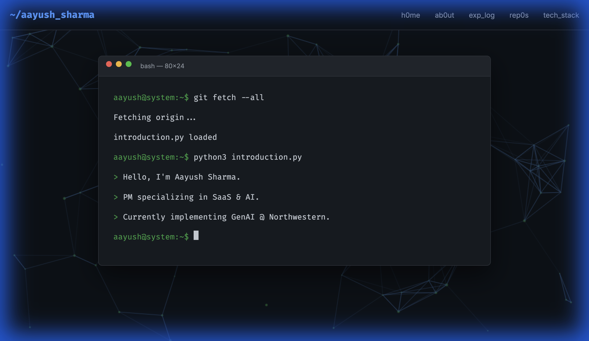

# AI Engineer Portfolio (The Sentient System)

> A futuristic, interactive portfolio website designed for the modern AI Engineer.

**Live Demo**: [Add your Netlify/Vercel link here]


*(Note: You can add a screenshot here later)*

## 🚀 Overview
This portfolio is not just a static resume; it's a living system. Built with **Vanilla HTML/CSS/JS**, it mimics a terminal interface and includes real-time telemetry from GitHub.

## ✨ Features

### v1.0: The Core
- **Terminal Hero**: Typewriter effect simulating a system boot sequence.
- **Neural Network Background**: Interactive HTML5 Canvas particle system.
- **System Log**: Experience timeline styled as a server log.
- **Repository Grid**: Project cards styled like GitHub/API documentation.

### v2.0: Telemetry (Active)
- **Live GitHub Heatmap**: Fetches real contribution data from the GitHub API (`dragonwarrior26`).
- **System Status**: Real-time IST clock and status pulse.

## 🛠️ Tech Stack
- **Frontend**: HTML5, CSS3 (Variables), JavaScript (ES6+)
- **Animations**: Canvas API, CSS Keyframes
- **Fonts**: Fira Code (Monospace), Inter (Sans-serif)
- **Icons**: FontAwesome 6

## 📦 Setup

1. Clone the repository:
   ```bash
   git clone https://github.com/dragonwarrior26/AI-Portfolio.git
   ```
2. Open `index.html` in your browser.

## 🔮 Roadmap
- [ ] **Phase 2**: "Insight" Chatbot (Gemini API Integration).
- [ ] **Phase 3**: "Neural Core" Interactive AI Playground.

## 📄 License
MIT License.
